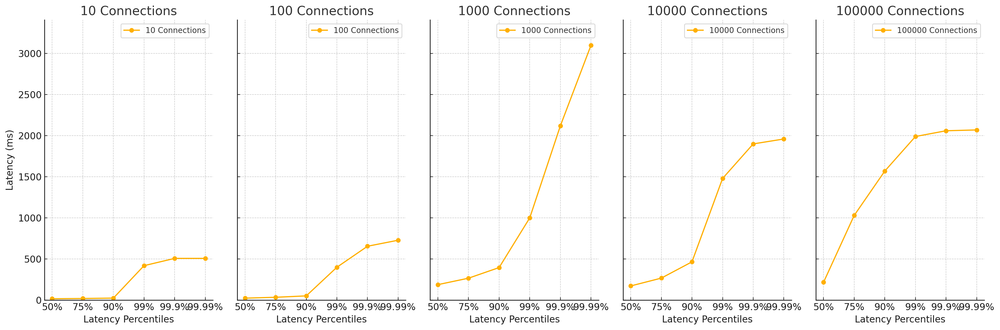
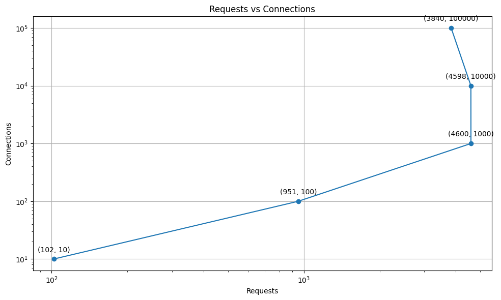
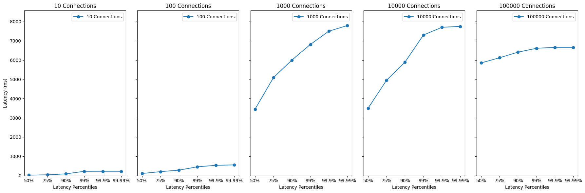
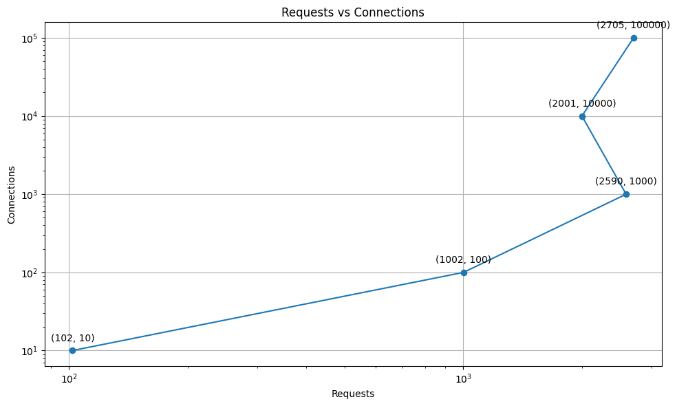

# wrk2로 성능 테스트하기

# 목표
- wrk2를 이용하여 성능 테스트를 해보자.
- 요청양에 따른 latency와 throughput을 측정해보자.
- 톰캣 서버의 설정을 변경하여 성능을 향상시켜보자.

# wrk2 설치하기
## MAC 에서 시도하기
처음 로컬 환경에서 wrk2를 설치하려고 했지만, 다음과 같은 에러가 발생했다. 
```terminal
#error "Need at least GCC 4.3 or newer"
 ^
3 errors generated.
lj_arch.h:55:2: error: "No support for this architecture (yet)"
```
wrk2 깃헙 이슈에서 관련 이슈를 찾아보았지만 Apple Silicon에서 해결 방법이 마땅치 않았다.
우선, wrk2 를 실행하는 것이 목표이기 때문에 다른 리소스를 사용하면 된다!

## Github Codespace 이용하기
클라우드 서비스에서 컴퓨팅 리소스를 하나 임대하는 것도 방법이다.
Github Codespace를 이용하면 **무료**로 리소스를 사용할 수 있다.
또한, linux 기반 컨테이너 서비스를 쉽게 사용할 수 있다.

## 서버 하드웨어 스펙
    2 cores
    8GB RAM
    32GB Storage

## JVM 17 구성하기
Codespace에는 기본적으로 JVM 21버전을 지원한다.
해당 프로젝트는 17버전을 사용하고 있기 때문에 17버전을 설치해야 한다.
Codespace는 컨테이너 기반이기 때문에 Docker 파일 설정하듯이 `devcontainer.json` 파일을 만들어서 설정을 변경할 수 있다.

```json
{
  "name": "Java",
  "image": "mcr.microsoft.com/devcontainers/java:1-17-bookworm",

  "features": {
    "ghcr.io/devcontainers/features/java:1": {}
  }
}
```

# wrk2 사용전 알아둘 개념 
[출처](https://www.youtube.com/watch?v=HSNyJnobBws)

### Latency vs Throughput
	Latency: 요청자 입장에서 완료까지 걸린 시간
	Throughput: 작업자 입장에서 시간 당 얼마나 처리했는지 

### wrk2가 wrk 보다 좋은 점
    wrk2는 work rate를 설정할 수 있다. 
    wrk2는 wrk보다 더 많은 요청을 처리할 수 있다. 
    wrk2는 wrk보다 더 많은 통계를 제공한다.

# 실제로 테스트해보기

## 가상 시나리오
이름, 이메일, 비밀번호를 입력받아 회원가입을 하는 API를 테스트해보자.
`post`요청이기 때문에 LIU 스크립트를 작성해야한다. 
wrk2는 liu 언어 스크립트를 지원한다.


## LIU 스크립트 짜기
```liu
# post.liu
wrk.method = "POST"
wrk.headers["content-type"] = "application/json"
wrk.body = "{ \"name\": \"kim\", \"email\": \"abc@mail.com\", \"password\": \"pasword1234\"}"
```

## Latency 측정하기

### con 10 - work rate 10
```
  Thread Stats   Avg      Stdev     Max   +/- Stdev
    Latency    30.35ms   68.92ms 507.39ms   97.00%
    Req/Sec       -nan      -nan   0.00      0.00%
  Latency Distribution (HdrHistogram - Recorded Latency)
 50.000%   16.64ms
 75.000%   19.85ms
 90.000%   24.50ms
 99.000%  419.07ms
 99.900%  507.65ms
 99.990%  507.65ms
 99.999%  507.65ms
100.000%  507.65ms
  102 requests in 10.02s, 47.71KB read
  Non-2xx or 3xx responses: 102
Requests/sec:     10.18
Transfer/sec:      4.76KB
```


### con100 - work rate 100
```
  2 threads and 100 connections
  Thread Stats   Avg      Stdev     Max   +/- Stdev
    Latency    35.91ms   58.93ms 728.06ms   96.94%
    Req/Sec       -nan      -nan   0.00      0.00%
  Latency Distribution (HdrHistogram - Recorded Latency)
 50.000%   23.82ms
 75.000%   34.72ms
 90.000%   51.55ms
 99.000%  399.87ms
 99.900%  655.36ms
 99.990%  728.58ms
 99.999%  728.58ms
100.000%  728.58ms
  951 requests in 10.03s, 444.71KB read
  Non-2xx or 3xx responses: 951
Requests/sec:     94.80
Transfer/sec:     44.33KB
```

### con1000 - work rate 1000
```
 2 threads and 1000 connections
  Thread Stats   Avg      Stdev     Max   +/- Stdev
    Latency   227.18ms  190.81ms   3.10s    88.71%
    Req/Sec       -nan      -nan   0.00      0.00%
  Latency Distribution (HdrHistogram - Recorded Latency)
 50.000%  188.16ms
 75.000%  266.75ms
 90.000%  396.03ms
 99.000%    1.00s 
 99.900%    2.12s 
 99.990%    3.10s 
 99.999%    3.10s 
100.000%    3.10s 

  4600 requests in 10.06s, 2.10MB read
  Socket errors: connect 0, read 0, write 0, timeout 1468
  Non-2xx or 3xx responses: 4600
Requests/sec:    457.07
Transfer/sec:    213.58KB
```

### con10000 - work rate 10000
```
  2 threads and 10000 connections
  Thread Stats   Avg      Stdev     Max   +/- Stdev
    Latency   247.48ms  253.14ms   1.96s    91.17%
    Req/Sec       -nan      -nan   0.00      0.00%
  Latency Distribution (HdrHistogram - Recorded Latency)
 50.000%  172.41ms
 75.000%  267.77ms
 90.000%  465.41ms
 99.000%    1.48s 
 99.900%    1.90s 
 99.990%    1.96s 
 99.999%    1.96s 
100.000%    1.96s 

  4598 requests in 10.04s, 2.10MB read
  Non-2xx or 3xx responses: 4598
Requests/sec:    457.84
Transfer/sec:    213.89KB
```

### con100,000 - work rate 100,000
```
  2 threads and 100000 connections
  Thread Stats   Avg      Stdev     Max   +/- Stdev
    Latency   553.04ms  612.92ms   2.07s    78.74%
    Req/Sec       -nan      -nan   0.00      0.00%
  Latency Distribution (HdrHistogram - Recorded Latency)
 50.000%  217.21ms
 75.000%    1.03s 
 90.000%    1.57s 
 99.000%    1.99s 
 99.900%    2.06s 
 99.990%    2.07s 
 99.999%    2.07s 
100.000%    2.07s 

  3840 requests in 10.73s, 1.75MB read
  Socket errors: connect 47, read 0, write 0, timeout 0
  Non-2xx or 3xx responses: 3840
Requests/sec:    357.86
Transfer/sec:    167.32KB
```
# 결과 분석



요청 1,000개일 때 latency가 최고치를 찍고 오히려 그 이후에 요청이 늘어날 수록 latency가 줄어드는 것을 확인할 수 있다. 
1000개 연결 이상일 때는 실제로 요청 건수가 줄어드는 것을 확인할 수 있다. 10초 동안 10n개 연결을 초 당 10n번 요청하면 100n 이 되어야 한다.
실제로 100개 연결과 100 work rate 일 때 951개 요청이 들어왔다. 하지만 1000개 이상 연결에서는 4600개 요청이 들어왔다. 10만 연결일 때 3840개 요청이 들어왔다.

# 왜 더 연결하지 못했나?
이 처럼 더 많은 연결을 하지 못한 이유를 생각해봤을 때, 웹서버 즉, 톰캣 서버의 설정이 문제일 수 있다. 
톰캣 서버의 설정을 변경해보자.

# Tomcat 설정 변경하기

## 기존 설정 확인하기 

```
// ServerProperties class 
		private int maxConnections = 8192;
		private int processorCache = 200; // thread pool size

```

## 스레드 풀 이해하기 
프로그램 실행에 필요한 Thread 미리 생성해 놓는 개념 

스레드 풀이 없다면 생기는 문제
- 모든 요청에 스레드를 새로 생성하고 소멸하면 OS와 JVM에 부담이 생긴다.
- 동시에 일정 다수 요청이 들어오면 리소스에 소모 억제가 어렵다. 즉, 순간적으로 서버에 많은 리소스가 들어오면 서버가 다운될 수 있다.

스레드 풀은 미리 스레드를 생성하여 생성하고 소멸하는 시간을 최소화하기 위한 방법이다. 
현재 스레드 풀의 크기는 200개이다. 우선 이 값을 늘려보자.

# 스레드 풀 크기 변경하기 
```application.properties
server.tomcat.max-threads=400

```

# 결과 
```
  2 threads and 10 connections
  Thread Stats   Avg      Stdev     Max   +/- Stdev
    Latency    43.04ms   54.74ms 223.49ms   90.00%
    Req/Sec       -nan      -nan   0.00      0.00%
  Latency Distribution (HdrHistogram - Recorded Latency)
 50.000%   23.76ms
 75.000%   39.23ms
 90.000%   89.21ms
 99.000%  221.31ms
 99.900%  223.62ms
 99.990%  223.62ms
 99.999%  223.62ms
100.000%  223.62ms

  102 requests in 10.01s, 25.48KB read
  Non-2xx or 3xx responses: 101
Requests/sec:     10.19
Transfer/sec:      2.55KB
```

```
  2 threads and 100 connections
  Thread Stats   Avg      Stdev     Max   +/- Stdev
    Latency   133.23ms  111.14ms 553.98ms   65.50%
    Req/Sec       -nan      -nan   0.00      0.00%
  Latency Distribution (HdrHistogram - Recorded Latency)
 50.000%  108.10ms
 75.000%  204.41ms
 90.000%  282.11ms
 99.000%  454.91ms
 99.900%  532.99ms
 99.990%  554.49ms
 99.999%  554.49ms
100.000%  554.49ms
  1002 requests in 10.01s, 251.48KB read
  Non-2xx or 3xx responses: 1002
Requests/sec:    100.14
Transfer/sec:     25.13KB
```

```
  2 threads and 1000 connections
  Thread Stats   Avg      Stdev     Max   +/- Stdev
    Latency     3.38s     1.98s    7.78s    60.28%
    Req/Sec       -nan      -nan   0.00      0.00%
  Latency Distribution (HdrHistogram - Recorded Latency)
 50.000%    3.45s 
 75.000%    5.09s 
 90.000%    6.00s 
 99.000%    6.81s 
 99.900%    7.50s 
 99.990%    7.79s 
 99.999%    7.79s 
100.000%    7.79s 

  2590 requests in 10.01s, 650.03KB read
  Socket errors: connect 0, read 0, write 0, timeout 1318
  Non-2xx or 3xx responses: 2590
Requests/sec:    258.69
Transfer/sec:     64.93KB
```

```
  2 threads and 10000 connections
  Thread Stats   Avg      Stdev     Max   +/- Stdev
    Latency     3.51s     1.85s    7.75s    63.18%
    Req/Sec       -nan      -nan   0.00      0.00%
  Latency Distribution (HdrHistogram - Recorded Latency)
 50.000%    3.50s 
 75.000%    4.95s 
 90.000%    5.89s 
 99.000%    7.30s 
 99.900%    7.70s 
 99.990%    7.75s 
 99.999%    7.75s 
100.000%    7.75s 

  2001 requests in 10.01s, 502.20KB read
  Non-2xx or 3xx responses: 2001
Requests/sec:    199.86
Transfer/sec:     50.16KB
```

```
  2 threads and 100000 connections
  Thread Stats   Avg      Stdev     Max   +/- Stdev
    Latency     5.77s   635.18ms   6.66s    85.99%
    Req/Sec       -nan      -nan   0.00      0.00%
  Latency Distribution (HdrHistogram - Recorded Latency)
 50.000%    5.85s 
 75.000%    6.12s 
 90.000%    6.41s 
 99.000%    6.61s 
 99.900%    6.66s 
 99.990%    6.66s 
 99.999%    6.66s 
100.000%    6.66s 

  2705 requests in 20.51s, 678.89KB read
  Non-2xx or 3xx responses: 2705
Requests/sec:    131.91
Transfer/sec:     33.11KB
```

# 결과 분석



스레드 풀을 400개로 늘렸을 때, 1000개 연결일 때 2590개 요청이 들어왔다. 10000개 연결일 때 2001개 요청이 들어왔다. 10만 연결일 때 2705개 요청이 들어왔다.
스레드 풀을 늘려서 더 나은 성능을 기대했던 것과 달리, 리터런시는 길어졌고 더 적은 처리량을 보였다. 
왜 이런 것일까? 

## 왜 더 연결하지 못했나?
스레드 풀을 더 이해할 필요가 있다. 스레드 풀은 다음과 같이 동작한다. 

    첫 작업이 들어오면, core size만큼의 스레드를 생성합니다.
    유저 요청(Connection, Server socket에서 accept한 소캣 객체)이 들어올 때마다 작업 큐(queue)에 담아둡니다.
    core size의 스레드 중, 유휴상태(idle)인 스레드가 있다면 작업 큐에서 작업을 꺼내 스레드에 작업을 할당하여 작업을 처리합니다.
    3-1. 만약 유휴상태인 스레드가 없다면, 작업은 작업 큐에서 대기합니다.
    3-2. 그 상태가 지속되어 작업 큐가 꽉 찬다면, 스레드를 새로 생성합니다.
    3-3. 3번과정을 반복하다 스레드 최대 사이즈 에 도달하고 작업큐도 꽉 차게 되면, 추가 요청에 대해선 connection-refused 오류를 반환합니다.
    태스크가 완료되면 스레드는 다시 유휴상태로 돌아갑니다.
    4-1. 작업큐가 비어있고 core size이상의 스레드가 생성되어있다면 스레드를 destory합니다.
    한줄요약 : 스레드를 미리 만들어놓고 필요한 작업에 할당했다가 돌려 받는다.
[출처](https://velog.io/@sihyung92/how-does-springboot-handle-multiple-requests)

이를 확인해보면 스레드 풀을 늘렸기 때문에 그 만큼 스레드를 생성하는 비용(시간)이 늘어나게 되었다. 
이 때문에 1000개 연결을 넘어가는 순간 급속도록 latency가 증가하게 되었다.
또한, 처리량도 늘어난 latency로 인해서 전체 작업 시간이 적체되면서 오랜 시간이 걸린 것으로 예상된다. 

# 결론

무조건 스레드 풀을 늘린다고 성능이 좋아지는 것은 아니다. 성능 테스트를 통해 최적의 스레드 풀 사이즈를 찾아야 한다.
스레드 풀 사이즈를 늘리는 것은 성능을 향상시키는 방법 중 하나일 뿐이다.
적절한 스레드 풀 크기를 키우는 것이 필요하다. 

# 한계 
- wrk2를 이용하여 성능 테스트를 진행하였지만, wrk2는 단순한 레이턴시와 처리량만을 확인할 수 있었다.
- 구체적인 성능 향상을 위해서는 JVM, GC, 메모리, CPU 등 다양한 요소를 고려해야 한다.

# 참고 
- https://haril.dev/blog/2023/11/10/Spring-MVC-Traffic-Testing
- https://medium.com/@haiou-a/spring-boot-how-many-requests-can-spring-boot-handle-simultaneously-a57b41bdba6a
- https://velog.io/@sihyung92/how-does-springboot-handle-multiple-requests
- https://nitikagarw.medium.com/getting-started-with-wrk-and-wrk2-benchmarking-6e3cdc76555f
- https://github-wiki-see.page/m/giltene/wrk2/wiki/Installing-wrk2-on-Linux
