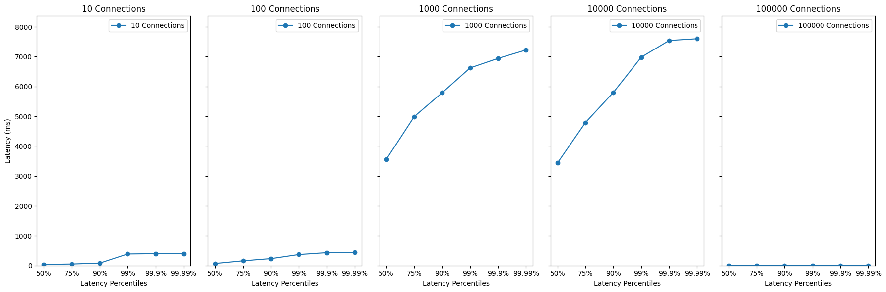

# 코어 사이즈 늘리기

# 배경
이전 테스트에서 단순히 스레드 풀의 크기를 키웠더니 오히려 더 오랜 시간이 걸리는 것으로 
확인되었다. 스레드 풀의 동작 원리를 생각해보면 오랜 시간이 걸린 원인이 스레드를 생성하고 소멸하는 과정에서
생기는 불필요한 오버헤드 때문이라고 생각할 수 있다. 이를 해결하기 위해 코어 사이즈를 늘려보자.
코어 사이즈란 스레드 풀의 최소 사이즈이라고 보면 된다. 
스레드 풀을 동작하기 위해서 최소 사이즈인 코어 사이즈를 기준으로 스레드를 생성한다. 
이전에 최대 스레드 풀의 크기를 키웠다면 미리 스레드 풀을 생성해놓으면 더 빠르게 작업할 수 있을 것으로 기대한다. 

# 목표
- 코어 사이즈를 늘려서 성능을 향상시킨다.

# 방법
application.properties에 다음과 같이 설정한다. 
```properties
server.tomcat.min-spare-threads=20 # 기본값은 10이다. 
```

```terminal
wrk -c{커넥션수} -d{지속시간} -R{동시처리수} -s {liu 스크립트 주소} -L {주소} 
```

# 결과 

## con 10 - work rate 10 
```
  2 threads and 10 connections
  Thread Stats   Avg      Stdev     Max   +/- Stdev
    Latency    63.09ms   90.37ms 397.57ms   90.00%
    Req/Sec       -nan      -nan   0.00      0.00%
  Latency Distribution (HdrHistogram - Recorded Latency)
 50.000%   35.42ms
 75.000%   49.85ms
 90.000%   81.47ms
 99.000%  387.07ms
 99.900%  397.82ms
 99.990%  397.82ms
 99.999%  397.82ms
100.000%  397.82ms
  102 requests in 10.02s, 25.48KB read
  Non-2xx or 3xx responses: 101
Requests/sec:     10.18
Transfer/sec:      2.54KB
```

## con 100 - work rate 100
```
  2 threads and 100 connections
  Thread Stats   Avg      Stdev     Max   +/- Stdev
    Latency    96.84ms   94.38ms 435.71ms   80.40%
    Req/Sec       -nan      -nan   0.00      0.00%
  Latency Distribution (HdrHistogram - Recorded Latency)
 50.000%   67.84ms
 75.000%  158.34ms
 90.000%  230.91ms
 99.000%  368.89ms
 99.900%  430.59ms
 99.990%  435.97ms
 99.999%  435.97ms
100.000%  435.97ms
  1002 requests in 10.05s, 251.48KB read
  Non-2xx or 3xx responses: 1002
Requests/sec:     99.74
Transfer/sec:     25.03KB
```

## con 1,000 - work rate 1,000
```
  2 threads and 1000 connections
  Thread Stats   Avg      Stdev     Max   +/- Stdev
    Latency     3.46s     1.73s    7.21s    56.85%
    Req/Sec       -nan      -nan   0.00      0.00%
  Latency Distribution (HdrHistogram - Recorded Latency)
 50.000%    3.56s 
 75.000%    4.99s 
 90.000%    5.79s 
 99.000%    6.62s 
 99.900%    6.94s 
 99.990%    7.22s 
 99.999%    7.22s 
100.000%    7.22s 
  2781 requests in 10.01s, 697.97KB read
  Socket errors: connect 0, read 0, write 0, timeout 1078
  Non-2xx or 3xx responses: 2781
```

## con 10,000 - work rate 10,000
```
  2 threads and 10000 connections
  Thread Stats   Avg      Stdev     Max   +/- Stdev
    Latency     3.33s     1.82s    7.60s    60.88%
    Req/Sec       -nan      -nan   0.00      0.00%
  Latency Distribution (HdrHistogram - Recorded Latency)
 50.000%    3.44s 
 75.000%    4.79s 
 90.000%    5.80s 
 99.000%    6.98s 
 99.900%    7.54s 
 99.990%    7.60s 
 99.999%    7.60s 
100.000%    7.60s 

  2287 requests in 10.01s, 573.98KB read
  Non-2xx or 3xx responses: 2287
Requests/sec:    228.50
Transfer/sec:     57.35KB
```

# 결과 분석


core-size를 늘렸지만 성능 측면에서 더 느려진 것을 확인할 수 있었다.
스레드 풀의 최대 크기를 늘렸을 때와 같이 더 느려졌다. 

이전 두 번 테스트를 비교해 볼 때, 가장 기본 설정이 성능이 가장 좋았다.(core-size 10, max-size 200)
그렇다면 단순히 core-size를 늘리는 것이 성능을 향상시키는 것은 아닌 것으로 보인다.

# 결론 
- core-size를 늘리는 것이 성능을 향상시키는 것은 아니다.
- core-size를 늘리는 것은 성능을 떨어뜨릴 수 있다.
- core-size와 max-size를 단순히 늘린다고 성능이 좋아지는 것은 아니다.

## 왜 스레드 풀의 크기를 늘려주면 성능이 떨어질까? 
크게 두 가지로 생각해볼 수 있다. CPU와 컨텍스트 스위칭 비용이다.
막연히 생각해볼 때, 스레드 풀 크기를 키우면 당연히 성능이 좋아져야 할 것 같다. 
일하는 유닛(스레드)가 늘어나니깐 더 좋은 성능을 내야한다. 
하지만 간과한 부분이 있다.
실제로 스레드를 처리하는 **CPU**를 생각하지 않았다.
컴퓨터 구조 관점에서 아무리 많은 작업 유닛(프로세스, 스레드)가 있더라 그것을 실제로 처리할 프로세서가 부족하면 성능이 떨어질 수 밖에 없다.
이를 염두해보면 무작정 스레드를 늘린다고 성능이 좋아지는 것은 아니다. 

또 다른 문제는 컨텍스트 스위칭 비용이다. 스레드가 많아지면 자연스럽게 경쟁해야 할 스레드가 많아진다. 
이는 스케줄링 관점에서 여러 스레드가 실행되기 위해서 컨텍스트 스위칭이 자연스럽게 이루어진다. 
이는 스레드가 많아질수록 컨텍스트 스위칭 비용이 늘어나게 된다.
즉, 스레드를 키운다고 해서 성능이 좋아지는 것은 아니다.

## 최적의 스레드 풀 크기 정하기 
그렇다면 어떻게 하면 적절하게 스레드 풀을 정할 수 있을까? 

대표적인 계산 방식은 다음과 같다. 
```
int optimalThreadPoolSize = numberOfCores * targetUtilization * (1 + waitTime / computeTime);
```
주요 팩터는 
- CPU 코어 수
- cpu 이용률 
- 대기 시간
- 실제 실행 시간

만약 4코어 컴퓨터에서 이용률을 0.8로 설정하고 대기 시간이 0.3초, 실행 시간이 0.1초라고 가정하면
``` 
int optimalThreadPoolSize = 4 * 0.8 * (1 + 0.3 / 0.1) = 4 * 0.8 * 4 = 12
```

컴퓨터 코어는 컴퓨터에 따라 결정되면 이용률은 정하기 나름이다.
즉, 코어와 이용률은 상수이다. 
최적의 스레드 풀 사이즈를 정하기 위해서는 대기 시간과 실행 시간을 측정해야 한다.

현재 wrk 테스트에서는 대기 시간과 실행 시간을 측정할 수 없다.
좀 더 구체적인 지표를 확인하기 위해서 다른 테스트를 해보자.

# 다음 테스트 
JVM, GC, 메모리, CPU 등 다양한 요소를 고려하여 성능 테스트를 진행하기 위해서 부화테스트 수행해보자. 


# 참고 
- https://junuuu.tistory.com/799
- https://docs.spring.io/spring-boot/appendix/application-properties/index.html#application-properties.server.server.tomcat.threads.min-spare
- https://backendhance.com/en/blog/2023/optimal-thread-pool-size/
- https://mucahit.io/2020/01/27/finding-ideal-jvm-thread-pool-size-with-kubernetes-and-docker/